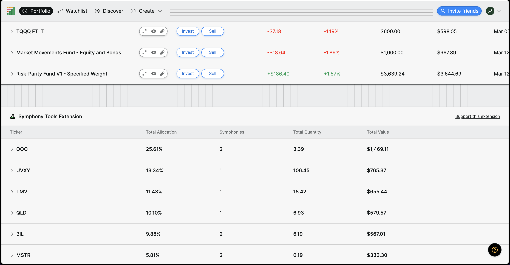
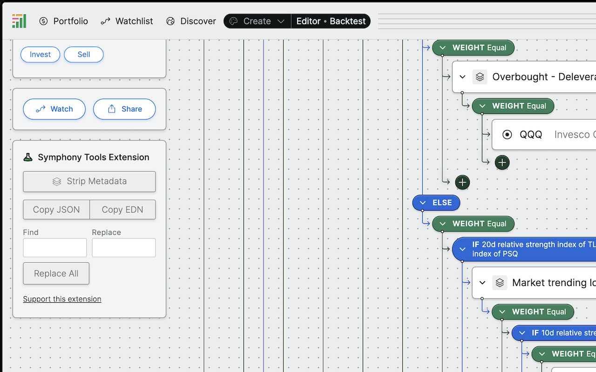

# symphony-tools
Chrome Extension that provides tools and enhancements to the Composer.trade user interface.

### Features
- Symphony Editor
  - Search and replace for assets and if/else logic in a Symphony
  - Remove metadata from a Symphony
  - Copy JSON / EDN
- Portfolio
  - Aggregate holdings and allocations across all symphonies
  - Display broker type for account (Alpaca/Apex)

Aggregate Holdings

Symphony Editor

### Installation

#### Chrome Web Store
The easiest way to install the extension is through the Chrome Web Store.

1. Go to https://chromewebstore.google.com/detail/symphony-tools-extension/gbmghoigiaomcfnnoijngbdnglpifbkk
2. Click "Add to Chrome"
3. If you have the composer site open in your browser, refresh the page so the widget can load. 
4. Where to find the widgets
    1. In the Symphony editor, the widget should appear on the sidebar under the Watch/Share buttons.
    2. In the portfolio view, the widget should appear at the bottom of the page under all your live symphonies

#### Manual Installation
1. Go to the latest release and download the .zip file
    https://github.com/dpods/symphony-tools/releases/latest
2. Unzip the contents 
3. In Chrome, navigate to [chrome://extensions](chrome://extensions/) in the URL bar 
4. Click the **Load unpacked** button and select the `src` folder (where the `manifest.json` file is).
5. If you have the composer site open in your browser, refresh the page so the widget can load.
6. Where to find the widgets
   1. In the Symphony editor, the widget should appear on the sidebar under the Watch/Share buttons. 
   2. In the portfolio view, the widget should appear at the bottom of the page under all your live symphonies

### Troubleshooting

Failed to load extension

**Manifest file is missing or unreadable** - Make sure you've unzipped the file. After clicking "Load unpacked" on the extensions page, navigate to the unzipped folder and click "Select"

### Donate

Donations are welcome but not necessary. If you find this tool useful and would like to support further development of new features you can donate here.

