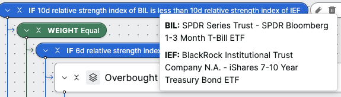
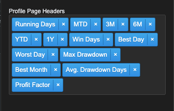
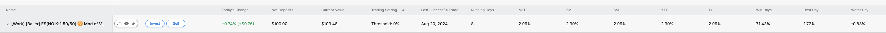
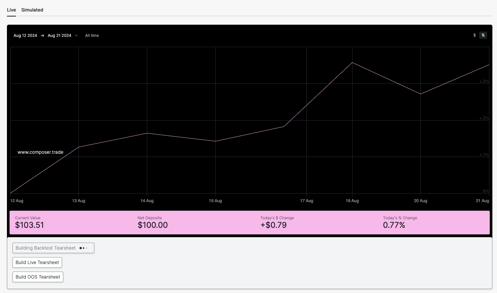

# composer-quant-tools
Chrome Extension that provides quantstats and enhancements to the Composer.trade user interface.

There is some kinda unique magic here where we use python in a service worker to run quantstats locally in your browser.
We generate Tearsheets in browser and build a blob url. These links are held in cache in your browser until your session on composer.trade closes.

### Features
- Portfolio
  - Display quant stats for live symphonies
  - Build Tearsheets in context for individual symphonies. Live, OOS, and full Backtest
  - Inline tooltips for describing tickers

Ticker Tooltip

Portfolio Quant Stats

Quant Stats Tearsheets

### Installation

#### Chrome Web Store Installation

Open this link and add it to your browser: [Composer Quant Tools](https://chromewebstore.google.com/detail/composer-quant-tools/hdpfpdpjpjfjjcnoggkjcklbagffblha)

#### Install from release

There are a couple options here.
Download the latest release from the [releases page](https://github.com/jhicken/composer-quant-tools/releases)

There is the direct .crx file. If you download this you might be able to just install it by double clicking it? I haven't tried this.

There is also a.zip file. This is the same as the.crx file but you can extract it then follow the manual installation instructions starting at step 4.

#### Manual Installation Requirements

1. npm (this must be installed)

#### Manual Installation
1. clone the project
2. open the folder
3. Run "npm run setup" in the cloned folder (this will download pyodide and a bunch of python libraries to bundle in the extension... thanks manifest v3...)
4. In Chrome, navigate to [chrome://extensions](chrome://extensions/) in the URL bar
5. Enable the developer toggle (top right corner)
5. Click the **Load unpacked** button and select the `src` folder (where the `manifest.json` file is).
6. If you have the composer site open in your browser, refresh the page so the widget can load.

### Troubleshooting

There are lots of bugs currently. So if you are having issues after loading the unpacked extension. The best thing to try is to go to your portfolio page and refresh the browser. Then refresh other pages you are on. This is due to how the api token is shared between windows.

I have also found that there can be some pretty big DOM differences between what feature flags are enabled for your user. So some of those are hard to work around.